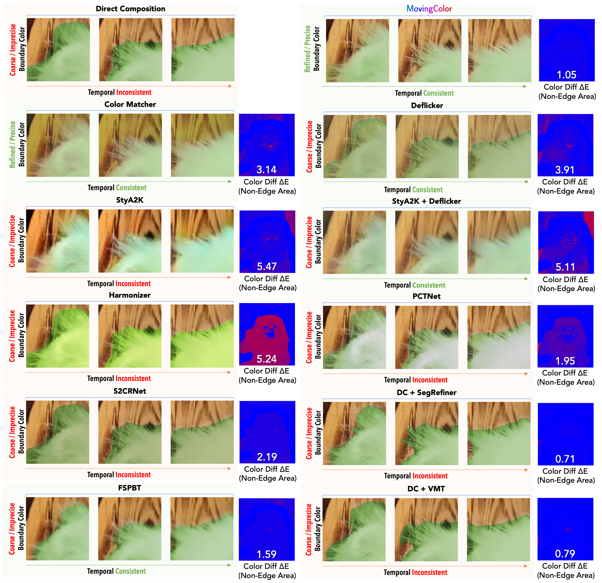

# MovingColor: Seamless Fusion of Fine-grained Video Color Enhancement
Official PyTorch Implementation of ACM MM 2024 (Oral) Paper "[MovingColor: Seamless Fusion of Fine-grained Video Color Enhancement](https://yidong.pro/projects/movingcolor/)"





# Environment
Tested on Ubuntu 20.04 + CUDA 11.3
```
conda create -n movingcolor python=3.9 -y
conda activate movingcolor
conda install -c conda-forge ffmpeg
pip install torch==1.12.1+cu113 torchvision==0.13.1+cu113 torchaudio==0.12.1 --extra-index-url https://download.pytorch.org/whl/cu113
pip install -r requirements.txt
```

# Data Preparation
## Training
1. Download [YouTube-VOS](https://youtube-vos.org/) dataset and put it in `datasets/youtube-vos`.
2. Unzip frames and resize to `datasets/youtube-vos/train_all_frames/JPEGImages_resize/output_432x240`


# Train
```
python train.py --config configs/train_MCGenerator_l1_vgg_gan.json
```
# Inference
```
python inference.py --config configs/inference_MCGenerator_l1_vgg_gan.json
```

# Acknowledgments
This code repository is partially borrowed from [LaMa](https://github.com/advimman/lama) and [ProPainter](https://github.com/sczhou/ProPainter).


# Citation
You can cite it as follows:
```
@inproceedings{dong2024movingcolor,
author = {Dong, Yi and Wang, Yuxi and Fang, Zheng and Ouyang, Wenqi and Lin, Xianhui and Shen, Zhiqi and Ren, Peiran and Xie, Xuansong and Huang, Qingming},
title = {MovingColor: Seamless Fusion of Fine-grained Video Color Enhancement},
year = {2024},
isbn = {9798400706868},
publisher = {Association for Computing Machinery},
address = {New York, NY, USA},
url = {https://doi.org/10.1145/3664647.3681130},
doi = {10.1145/3664647.3681130},
booktitle = {Proceedings of the 32nd ACM International Conference on Multimedia},
pages = {7454–7463},
numpages = {10},
keywords = {color fusion, video color enhancement, video editing},
location = {Melbourne VIC, Australia},
series = {MM '24}
}
```
